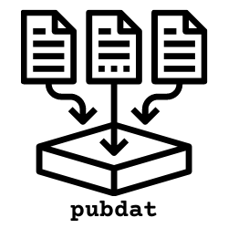

# pubdat
Utilities for collecting and analyzing publicly available information.

## Overview
The Pubdat repository is the result of me spending years writing various snippets and scripts to handle some scraping or analysis project and then forgetting about them.  I probably re-invented my basic Reddit scraping pipeline four times in the last five years.
\
Initially the focus will be on Reddit data as that is what I have mostly worked on over the last few years, but I will also be adding utilities for other social media APIs and traditional media sites.  Publicly available data is tremendously useful for a range of research and analytic activities, and social media data in particular is helpful for work into NLP or other deep learning projects. I wanted to capture some of my experience with this data, both to help myself and perhaps provide some guidance to people starting out in the area.

The [pubdat wiki](https://github.com/jomorrcode/pubdat/wiki) will contain more detailed information on the various utilities as they are added.  This is a work in progress and will continue to grow as I go through all my old notebooks and scripts to find interesting functionality that should be captured in the repo.